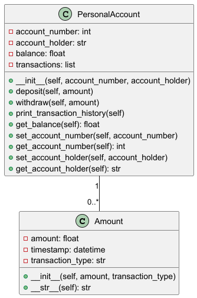

# **Personal Account Management in Python**  

## **Project Description**  
This Python project is designed to manage a personal bank account using Object-Oriented Programming (OOP). The program allows users to deposit and withdraw money, track their account balance, and maintain a transaction history.

---

## **Features**  
- Deposit funds to the account.  
- Withdraw funds with balance verification.  
- Display current account balance.  
- View a detailed transaction history with timestamps.  

---

## **Project Structure**  
PersonalAccountProject/ ├── amount.py # Defines the Amount class for transactions ├── personal_account.py # Defines the PersonalAccount class for account operations ├── main.py # Main entry point for the program └── README.md # Project documentation

## **How to Run the Project**  

### **Step 1: Clone or Download the Project**  
Clone the repository (after uploading it to GitHub) or download it manually:
```bash
git clone <your-repository-url>
Run the Program
Ensure that Python is installed on your computer.
Open main.py and click the green run button or run it in the terminal:
bash
python main.py
How to Use
Enter a deposit amount to add money to the account.
Enter a withdrawal amount to remove money (if the balance allows).
View the transaction history and the current account balance.
Example Test Case
plaintext
Initial Account Balance: $0.00  
Deposit $1000  
Balance after deposit: $1000.00  
Withdraw $300  
Balance after withdrawal: $700.00  
Transaction History:
- DEPOSIT: $1000 on 2025-02-10 12:30:45  
- WITHDRAWAL: $300 on 2025-02-10 12:45:12
Files Description
amount.py: Handles transaction details (amount, timestamp, and transaction type).
personal_account.py: Manages account operations, including deposit, withdrawal, and transaction history.
main.py: Entry point of the program.




